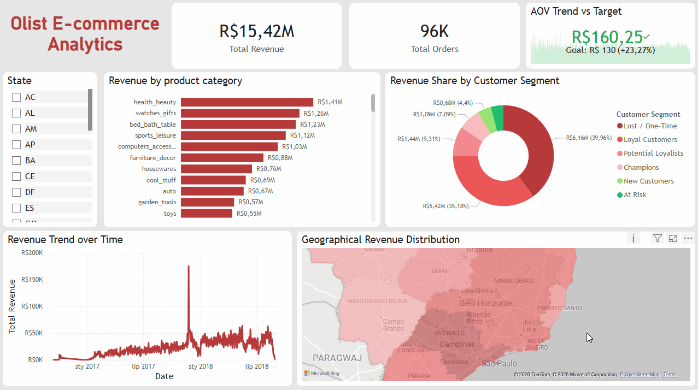

# 🛒 Olist E-commerce Analytics: End-to-End Data Pipeline & Dashboard


A comprehensive, end-to-end data analytics project based on a real-world dataset from **Olist**, a Brazilian e-commerce platform. This project covers the entire data lifecycle: from extracting raw CSV files, cleaning and loading them into a relational database (ETL process), performing customer segmentation using the RFM model in Python, to designing an interactive Executive Dashboard in Power BI.

---

## 📊 Executive Dashboard (Power BI)

*(Below is an interactive demo of the dashboard. Please allow a moment for the GIF to load)*



> **💡 Tip:** You can download the `olist ecommerce.pbix` file from this repository to test the dashboard interactively on your local machine.

---

## 📂 Data Source (The Olist Dataset)

The data used in this project is the **[Brazilian E-Commerce Public Dataset by Olist](https://www.kaggle.com/datasets/olistbr/brazilian-ecommerce)**, publicly available on Kaggle.

* **Scale:** The dataset contains information on ~100,000 real orders made at multiple marketplaces in Brazil from 2016 to 2018.
* **Structure:** It consists of 9 distinct CSV files (Customers, Orders, Order Items, Payments, Products, Reviews, Geolocation, Sellers, and Category Name Translation) forming a complex relational schema.

---

## 🛠️ Tech Stack & Architecture

This project was built using a modern Data Analyst tech stack:

### 1. Data Engineering & ETL
    

* **Process:** Extracted 9 distinct tables from raw CSV files. Handled missing values (NaN), converted data types (e.g., datetime formatting), verified foreign keys, and loaded the cleaned data into a local MySQL database using automated Python scripts.

### 2. Data Storage & Modeling
 
* **Process:** Designed a relational database storing normalized tables. Created optimized SQL `VIEWS` serving as a Single Source of Truth for BI tools, ensuring data consistency and minimizing network load.

### 3. Data Science & Advanced Analytics

* **Process:** Performed **RFM (Recency, Frequency, Monetary) Segmentation** on a database of over 90,000 customers. Classified users into behavioral cohorts (e.g., *Champions*, *At Risk*, *Lost / One-Time*) to enable highly targeted marketing campaigns.

### 4. Data Visualization & Business Intelligence
 
* **Process:** Built a **Star Schema** data model (Fact and Dimension tables). Implemented advanced conditional formatting (Choropleth Maps), dynamic KPI indicators, and Custom Tooltips for an intuitive user experience.

---

## 🧠 Key Analytical Challenges & Solutions

During the development of this project, I encountered and resolved several technical and business challenges:

### Challenge 1: Customer Classification (Lack of Labels)
The raw dataset only contained transactional data, providing no insights into customer "quality" or loyalty.
**Solution:** Implemented **RFM analysis** in Python. I assigned a score from 1 to 5 for Recency, Frequency, and Monetary value to each customer, combining them into actionable profiles.

```python
# Python snippet - Calculating RFM metrics
query = """
SELECT 
    customer_unique_id, 
    purchase_date, 
    (product_price + delivery_cost) AS total_value
FROM vw_master_sales
"""

df = pd.read_sql(query, engine)

df['purchase_date'] = pd.to_datetime(df['purchase_date'])
reference_date = df['purchase_date'].max() + dt.timedelta(days=1)

rfm = df.groupby('customer_unique_id').agg({
    'purchase_date': lambda x: (reference_date -x.max()).days,
    'customer_unique_id': 'count',
    'total_value': 'sum'
})

rfm.rename(columns={
    'purchase_date': 'Recency',
    'customer_unique_id': 'Frequency',
    'total_value': 'Monetary'
}, inplace=True)

rfm.reset_index(inplace=True)
```

### Challenge 2: Efficient Data Transfer to Power BI
Importing 9 separate tables into Power BI and joining them within the BI tool caused a messy data model and performance drops.
**Solution:** Shifted the `JOIN` logic "closer to the data" – at the MySQL engine level – by creating a dedicated analytical view.

```sql
-- SQL snippet - Creating the Master View
CREATE OR REPLACE VIEW vw_master_sales AS
SELECT
	o.order_id,
    c.customer_unique_id,
    c.customer_city,
    c.customer_state,
    DATE(o.order_purchase_timestamp) AS purchase_date,
    oi.product_id,
    oi.price AS product_price,
    oi.freight_value AS delivery_cost,
    COALESCE(t.product_category_name_english, p.product_category_name, 'Unknown') AS product_category
FROM orders o 
JOIN customers c
	ON o.customer_id = c.customer_id
JOIN order_items oi
	ON o.order_id = oi.order_id
LEFT JOIN products p 
	ON oi.product_id = p.product_id
LEFT JOIN product_category_name_translation t
	ON p.product_category_name = t.product_category_name
WHERE o.order_status = 'delivered';
```

### Challenge 3: "Broken" KPIs during Time-Axis Filtering (DAX)
When filtering for "Lost" customers (who hadn't made a purchase in a long time), the main KPI card displayed a `(Blank)` error because the Target line extended indefinitely into the future timeline.
**Solution:** Created a dynamic DAX measure that cuts off the target line when there is no revenue generated.

```dax
/* DAX snippet - Dynamic KPI Target */
Target AOV = 
IF(
    ISBLANK([Total Revenue]), 
    BLANK(), 
    130
)
```

### Challenge 4: Information Overload on Maps
Placing a Donut Chart with 70 product categories as a Map Tooltip made it completely unreadable.
**Solution:** Applied a dynamic **Top N filter** combined with a Bar Chart on a hidden report page. Now, hovering over a state (e.g., São Paulo) triggers a clean tooltip displaying only the Top 3 best-selling categories for that specific region.

---

## 📈 Key Business Insights

1. **The Retention Problem (One-Time Buyers):** The vast majority of the platform's revenue comes from the *Lost / One-Time* customer segment. This indicates that while Olist excels at user acquisition, it suffers from drastically low customer loyalty (Life-Time Value). Implementing robust loyalty programs should be a top priority.
2. **Geographical Dominance (São Paulo):** The state of São Paulo (SP) generates the lion's share of the company's profits. Logistical expansion and infrastructure improvements should secure this state first before heavily investing in marketing for the northern regions.
3. **Revenue-Driving Categories:** *Health_Beauty* and *Watches_Gifts* lead the overall rankings, generating the highest revenue. This suggests high profit margins and strong demand within the lifestyle sector.

---

## 🚀 How to Run the Project Locally

1. Clone the repository to your local machine:
   ```bash
   git clone [https://github.com/](https://github.com/Kuba27x/olist-ecommerce-analytics.git)
   ```
2. **Database Setup:** Execute the SQL scripts located in the `sql_scripts` folder to create the database schema and views.
3. **ETL & Data Science:** Run the Jupyter Notebooks (`.ipynb`) in the `notebooks` folder to perform data cleaning and RFM segmentation. *(Requires downloading the raw dataset from Kaggle).*
4. **Dashboard:** Open the `olist ecommerce.pbix` file using **Power BI Desktop** (available for free on Windows).
